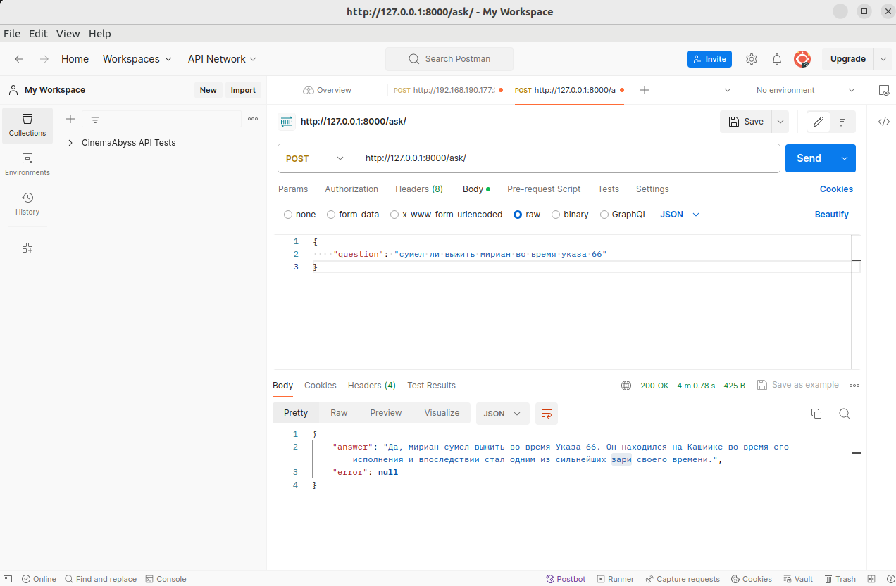
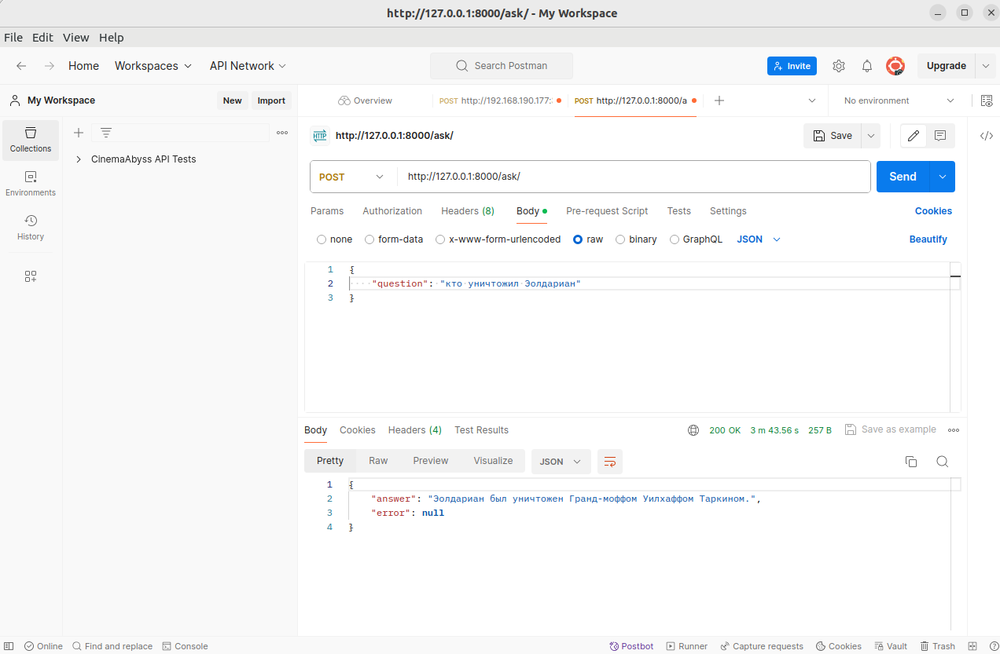
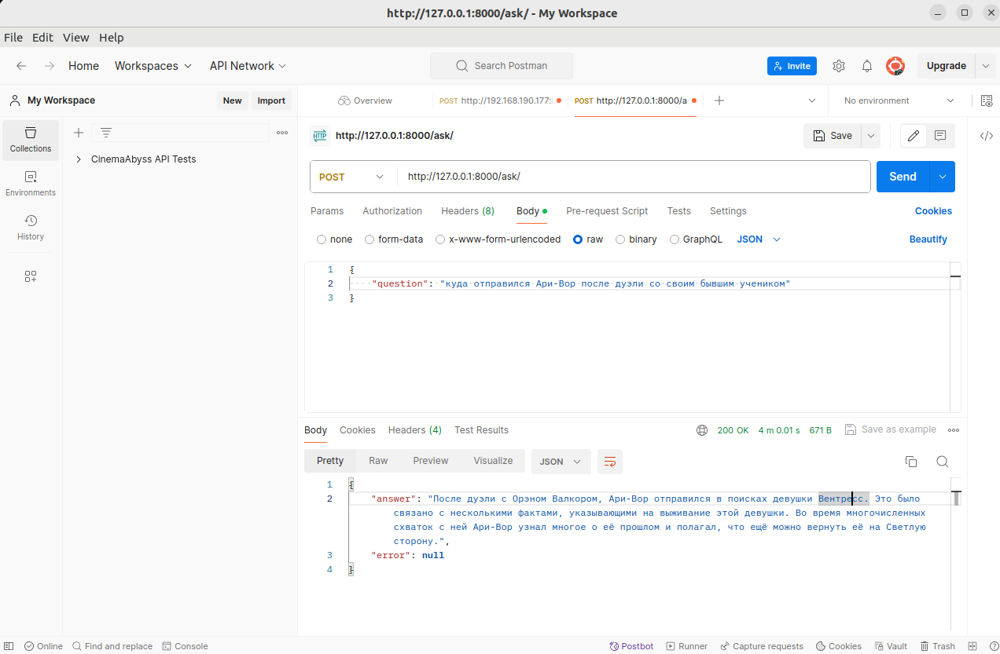
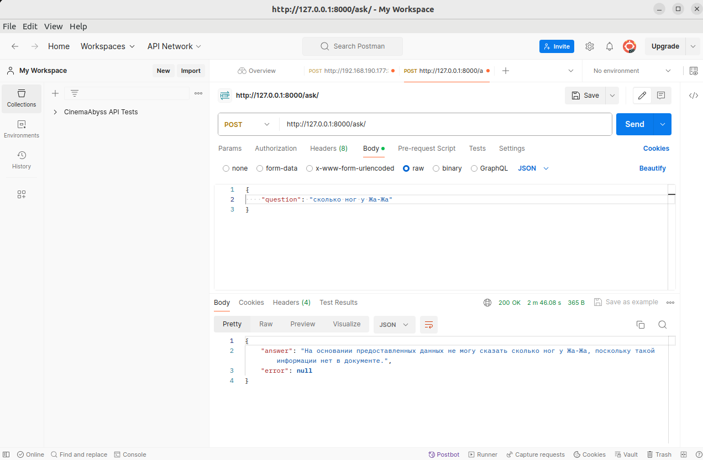

# Реализация RAG-бота с техниками промптинга

#### Запуск проекта

Все команды необходимо выполнять из корневой директории проекта.

Запуск LLM Mistral локально

```bash
docker compose -f app/docker-compose.yml up -d
```

Запуск FastAPI приложения

```bash
python -m app.main
```

#### Индексирование knowledge_base

Проиндексированная база должна была быть создана в предыдущем задании. Если ее нет, файлы будут созданы при запуске приложения.

## Скриншоты







